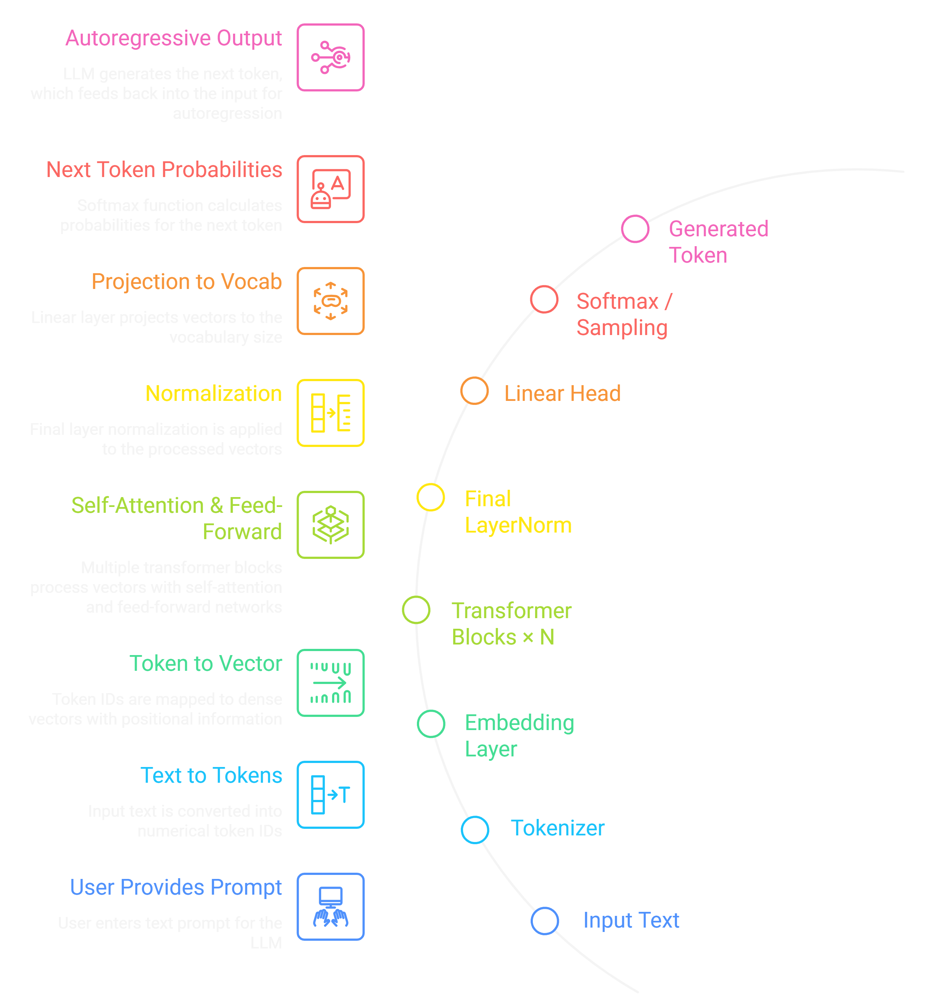

<h1 align="center">LLM From Scratch — GPT-Style Transformer</h1>

<div align="center">


**A complete GPT-style Large Language Model built from the ground up — no shortcuts, no black boxes.**

*Tokenization → Embeddings → Self-Attention → Transformer Blocks → Training → Generation → Chat UI*

</div>

---

## 📌 Overview

This project is a fully hand-crafted implementation of a GPT-style Large Language Model using **Python** and **PyTorch**. Every component — from the tokenizer to the transformer decoder stack — is written from scratch to give a deep, transparent understanding of how modern LLMs actually work under the hood.

It goes beyond just the model. A **Flask/FastAPI backend** exposes the trained model via REST APIs, and a **React-based chat interface** brings it to life with a clean, interactive UI — making it a complete end-to-end AI system, not just a research notebook.

Whether you're a student, researcher, or engineer, this project serves as the most honest and thorough reference for understanding the internals of large language models.

---

## ✨ Features

- 🔡 **Custom Tokenizer** — Character-level or BPE-style tokenizer built from scratch on your own dataset
- 📐 **Token & Positional Embeddings** — Learned embedding layers with positional encoding
- 🔍 **Multi-Head Self-Attention** — Full implementation of scaled dot-product attention with multiple heads
- 🧱 **Transformer Decoder Blocks** — Stacked blocks with layer norm, residual connections, and feed-forward networks
- 🔁 **End-to-End Training Loop** — Loss tracking, gradient clipping, learning rate scheduling
- 💬 **Text Generation** — Autoregressive sampling with temperature and top-k controls
- 🌐 **REST API Backend** — Model served over localhost with clean JSON endpoints
- ⚛️ **React Chat UI** — A polished conversational frontend that talks to the backend in real time
- 📊 **Loss Visualization** — Training progress tracked and exportable
- 🧩 **Fully Modular Codebase** — Every component is isolated, readable, and replaceable

---

## 🏗️ Architecture

The model follows the standard GPT-style **decoder-only transformer** architecture.

<p align="center">
  
</p>

**Key Design Choices:**
- Causal (masked) self-attention prevents the model from seeing future tokens
- Residual connections around every sub-layer stabilize deep training
- Layer normalization applied before each sub-layer (Pre-LN style)
- Weight tying between token embedding and output projection layer

---

## 🛠️ Tech Stack

| Layer | Technology | Purpose |
|---|---|---|
| Core Model | Python 3.10+, PyTorch 2.0+ | Model definition, training, inference |
| Tokenizer | Custom Python | Vocabulary building, encode/decode |
| Training | PyTorch + AdamW | Gradient-based optimization |
| Backend API | Flask / FastAPI | Serving model predictions via HTTP |
| Frontend | React 18, Axios | Chat UI, user interaction |
| Styling | CSS / TailwindCSS | Frontend design |
| Data | Plain `.txt` file | Raw training corpus |
| Environment | Python venv / conda | Dependency isolation |

---

## 📁 Project Structure

```
llm-from-scratch/
│
├── BACKEND/
│   ├── model.py              # GPT model definition (embeddings, attention, blocks)
│   ├── attention.py          # Multi-head self-attention implementation
│   ├── transformer_block.py  # Single transformer decoder block
│   ├── tokenizer.py          # Custom tokenizer (encode/decode)
│   ├── dataset.py            # Dataset class + data loading utilities
│   ├── train.py              # Training loop with loss tracking
│   ├── generate.py           # Autoregressive text generation
│   ├── config.py             # Model hyperparameters and settings
│   └── server.py             # API server (Flask/FastAPI endpoints)
│
├── FRONTEND/
│   ├── public/
│   │   └── index.html
│   ├── src/
│   │   ├── App.jsx           # Root component
│   │   ├── Chat.jsx          # Chat interface component
│   │   ├── api.js            # Axios API calls to backend
│   │   └── index.css         # Styling
│   ├── package.json
│   └── package-lock.json
│
├── data.txt                  # Training dataset (raw text corpus)
├── requirements.txt          # Python dependencies
├── LICENSE
└── README.md
```

---

## ⚙️ Installation & Setup

### Prerequisites

- Python 3.10 or higher
- Node.js 18 or higher
- npm or yarn
- A CUDA-capable GPU (recommended) or CPU

### 1. Clone the Repository

```bash
git clone https://github.com/llm-from-scratch/gpt-transformer.git
cd gpt-transformer
```

### 2. Set Up Python Environment

```bash
# Create and activate a virtual environment
python -m venv venv
source venv/bin/activate        # On Windows: venv\Scripts\activate

# Install Python dependencies
pip install -r requirements.txt
```

### 3. Install Frontend Dependencies

```bash
cd FRONTEND
npm install
```

---

## 🚀 Running the Project

### Step 1 — Train the Model

Prepare your training data in `data.txt`, then run:

```bash
cd BACKEND
python train.py
```

This will:
- Build the vocabulary from `data.txt`
- Initialize the GPT model
- Run the training loop
- Save model checkpoints to `checkpoints/`
- Print training loss at each step

You can configure training parameters in `config.py`:

```python
# config.py
VOCAB_SIZE     = 256        # Adjusted automatically from data
EMBED_DIM      = 128        # Token embedding dimension
NUM_HEADS      = 4          # Number of attention heads
NUM_LAYERS     = 4          # Number of transformer blocks
CONTEXT_LENGTH = 128        # Max sequence length
BATCH_SIZE     = 32         # Training batch size
LEARNING_RATE  = 3e-4       # AdamW learning rate
MAX_ITERS      = 5000       # Total training iterations
```

### Step 2 — Start the Backend API

```bash
cd BACKEND
python server.py
```

The API server will start at `http://localhost:5000`.

### Step 3 — Start the Frontend

```bash
cd FRONTEND
npm start
```

The React app will open at `http://localhost:3000`.

---

## 🔌 API Flow

The backend exposes simple REST endpoints that the frontend communicates with.

```
React Frontend (port 3000)
        │
        │  POST /generate
        │  Body: { "prompt": "Once upon a time", "max_tokens": 100 }
        │
        ▼
Flask/FastAPI Backend (port 5000)
        │
        │  1. Tokenize the prompt
        │  2. Convert to tensor
        │  3. Run forward pass through GPT
        │  4. Sample next token (temperature / top-k)
        │  5. Repeat until max_tokens reached
        │  6. Decode token IDs back to text
        │
        ▼
Response: { "generated_text": "Once upon a time there was a..." }
```

### Available Endpoints

| Method | Endpoint | Description |
|---|---|---|
| `POST` | `/generate` | Generate text from a given prompt |
| `GET` | `/health` | Check if the server is running |
| `GET` | `/model-info` | Returns model config and vocab size |

### Example Request

```bash
curl -X POST http://localhost:5000/generate \
  -H "Content-Type: application/json" \
  -d '{"prompt": "The scientist looked at the data and", "max_tokens": 80}'
```

### Example Response

```json
{
  "generated_text": "The scientist looked at the data and realized the pattern had been there all along. The numbers told a story no one had thought to read.",
  "tokens_generated": 80,
  "model": "GPT-Scratch v1.0"
}
```

---

## 🏋️ Training Instructions

### Preparing Your Dataset

Place any plain text file as `data.txt` in the root directory. The larger and more coherent the text, the better the model's output quality.

```bash
# Example: use a book, articles, or any text corpus
cp my_corpus.txt data.txt
```

### Running Training

```bash
cd BACKEND
python train.py
```

### Training Output

```
Step 0    | Loss: 4.3521
Step 100  | Loss: 3.1204
Step 500  | Loss: 2.4837
Step 1000 | Loss: 1.9342
Step 2000 | Loss: 1.5819
Step 5000 | Loss: 1.1247
Training complete. Model saved to checkpoints/model_final.pt
```

### Resuming from Checkpoint

```python
# In train.py, set:
RESUME_FROM_CHECKPOINT = True
CHECKPOINT_PATH = "checkpoints/model_step_2000.pt"
```

---

## 💬 Text Generation

You can generate text directly from the command line without starting the server:

```bash
cd BACKEND
python generate.py --prompt "The meaning of life is" --max_tokens 100 --temperature 0.8
```

### Generation Parameters

| Parameter | Default | Description |
|---|---|---|
| `--prompt` | Required | Starting text for generation |
| `--max_tokens` | `100` | Number of tokens to generate |
| `--temperature` | `0.8` | Controls randomness (0.1 = focused, 1.5 = creative) |
| `--top_k` | `40` | Limits sampling to top K probable tokens |
| `--checkpoint` | `model_final.pt` | Path to model weights |

---

## 🖥️ Example Outputs

After training on a general literature corpus for ~5000 steps:

**Prompt:** `"The old man walked to the edge of"`

```
The old man walked to the edge of the cliff and looked out at the sea.
The wind pulled at his coat. He had stood here before, many years ago,
when things were different and the world had not yet grown so quiet.
```

---

**Prompt:** `"In the beginning, the universe"`

```
In the beginning, the universe was without form, a vast expanse of
nothing that held everything within its silence. Then something shifted,
and the first light broke across the dark like a question no one had asked.
```

---

**Prompt:** `"She opened the letter and read"`

```
She opened the letter and read the words twice, then a third time.
Her hands were steady but her breath was not. After all this time,
she had not expected the truth to arrive in an envelope.
```

---

## 📚 Core Concepts Explained

| Concept | What It Does |
|---|---|
| **Tokenization** | Breaks raw text into integer tokens the model can process |
| **Token Embedding** | Maps each token ID to a dense learnable vector |
| **Positional Encoding** | Injects position information so the model knows token order |
| **Self-Attention** | Lets each token dynamically focus on other tokens in the sequence |
| **Multi-Head Attention** | Runs several attention operations in parallel for richer representations |
| **Causal Mask** | Blocks each token from attending to future positions during training |
| **Feed-Forward Network** | Applies non-linear transformation after attention in each block |
| **Residual Connection** | Adds input back to output of each sub-layer to prevent gradient vanishing |
| **Layer Normalization** | Stabilizes activations across the layer for faster, more stable training |
| **Softmax Sampling** | Converts final logits to a probability distribution for token selection |
| **Temperature** | Scales logits before softmax to control generation diversity |
| **Top-K Sampling** | Restricts generation to the K most likely tokens to reduce incoherence |

---

## 📏 Evaluation Approach

This project uses the following methods to assess model quality:

- **Training Loss (Cross-Entropy)** — Primary metric; should decrease steadily over iterations
- **Perplexity** — Exponential of cross-entropy loss; lower is better (measures how "surprised" the model is by data)
- **Qualitative Output Review** — Manual inspection of generated text for coherence, fluency, and relevance
- **Prompt Consistency Tests** — Testing whether the model continues prompts in a logically consistent way
- **Overfitting Check** — Comparing train loss vs. validation loss to detect memorization vs. generalization

> For small models trained on small datasets, some level of overfitting is expected. The goal is to demonstrate the mechanics, not to achieve state-of-the-art perplexity.

---

## ⚠️ Limitations

Being transparent about what this project is and isn't:

- **Small Scale by Design** — This is a learning-oriented implementation, not a production LLM. It won't match GPT-4 or even GPT-2 in quality.
- **Dataset Dependent** — Output quality is heavily tied to the quality and size of `data.txt`. Small or low-quality data produces incoherent output.
- **No RLHF or Alignment** — The model has no instruction-following or safety fine-tuning.
- **Context Window Limits** — Fixed context length means the model cannot handle very long inputs without truncation.
- **Inference Speed** — Not optimized for fast inference; no quantization or batching on the API layer.
- **Character-Level Tokenization Trade-offs** — If using character-level tokenization, vocabulary is small but sequence lengths are long.

---

## 🔮 Future Improvements

- [ ] Add Byte-Pair Encoding (BPE) tokenizer for more efficient vocabulary
- [ ] Implement learning rate warmup + cosine decay schedule
- [ ] Add gradient accumulation for larger effective batch sizes
- [ ] Plug in Weights & Biases for experiment tracking
- [ ] Add instruction fine-tuning (SFT) capability
- [ ] Support model quantization (INT8) for faster CPU inference
- [ ] Extend context length using rotary positional embeddings (RoPE)
- [ ] Add streaming token generation to the React frontend
- [ ] Write unit tests for each module
- [ ] Dockerize the entire stack for one-command deployment

---

## 🤝 Contributing

Contributions are welcome and appreciated. Here's how to get involved:

1. **Fork** this repository
2. **Create** a new feature branch: `git checkout -b feature/your-feature-name`
3. **Make** your changes and write clear, commented code
4. **Test** that training, generation, and the API all still work correctly
5. **Commit** your changes: `git commit -m "feat: add your feature"`
6. **Push** to your branch: `git push origin feature/your-feature-name`
7. **Open** a Pull Request with a clear description of the change

### Code Style Guidelines

- Keep Python files modular — one responsibility per file
- Use type hints wherever possible
- Comment non-obvious logic, especially inside the attention mechanism
- Follow PEP 8 for Python; standard React conventions for frontend

---

## 📄 License

This project is licensed under the **MIT License**.

```
MIT License

Permission is hereby granted, free of charge, to any person obtaining a copy
of this software and associated documentation files (the "Software"), to deal
in the Software without restriction, including without limitation the rights
to use, copy, modify, merge, publish, distribute, sublicense, and/or sell
copies of the Software, and to permit persons to whom the Software is
furnished to do so, subject to the following conditions:

The above copyright notice and this permission notice shall be included in
all copies or substantial portions of the Software.

THE SOFTWARE IS PROVIDED "AS IS", WITHOUT WARRANTY OF ANY KIND, EXPRESS OR
IMPLIED, INCLUDING BUT NOT LIMITED TO THE WARRANTIES OF MERCHANTABILITY,
FITNESS FOR A PARTICULAR PURPOSE AND NONINFRINGEMENT.
```

See the [LICENSE](./LICENSE) file for full details.

---

## 💬 Support

If you found this useful:

- Star the repo  
- Fork it  
- Share it
  
---

## 🌟 Closing Note

This project exists because the best way to truly understand something is to build it yourself — from the very first token to the last generated word. Every matrix multiplication, every attention score, every residual addition in this codebase is intentional and explained.

Modern LLMs often feel like magic. This project is the magician showing you exactly how the trick is done.

If this helped you understand transformers more deeply, consider leaving a ⭐ — it helps others find the project and keeps the momentum going.

> *"What I cannot create, I do not understand."* — Richard Feynman
